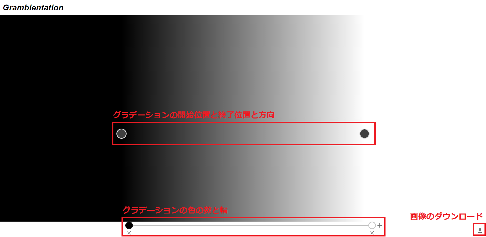

# __Grambientation__

Grambientationは，[私](https://github.com/do-i-know-it)がWebフロントエンドとして

- [Webpack](https://webpack.js.org/)
- [ESLint](https://eslint.org/)
- [Prettier](https://prettier.io/)
- [TypeScript](https://www.typescriptlang.org/)
- [React](https://reactjs.org/)

を使った開発を独学するための習作として開発したグラデーション画像生成ツールでありで

- [Grabient](https://www.grabient.com/)
- [GradPad](http://ourownthing.co.uk/gradpad.html)
- [uiGradients](https://uigradients.com)

を参考に実装し，[Netlify](https://www.netlify.com/)にデプロイした．

## __How to use__

Grambientationは

- グラデーションの開始位置と終了位置と方向の制御
- グラデーションの色の数と幅の制御
- 画像のダウンロード

ができる．

### __グラデーションの開始位置と終了位置と方向の制御__

### __グラデーションの色の数と幅の制御__

